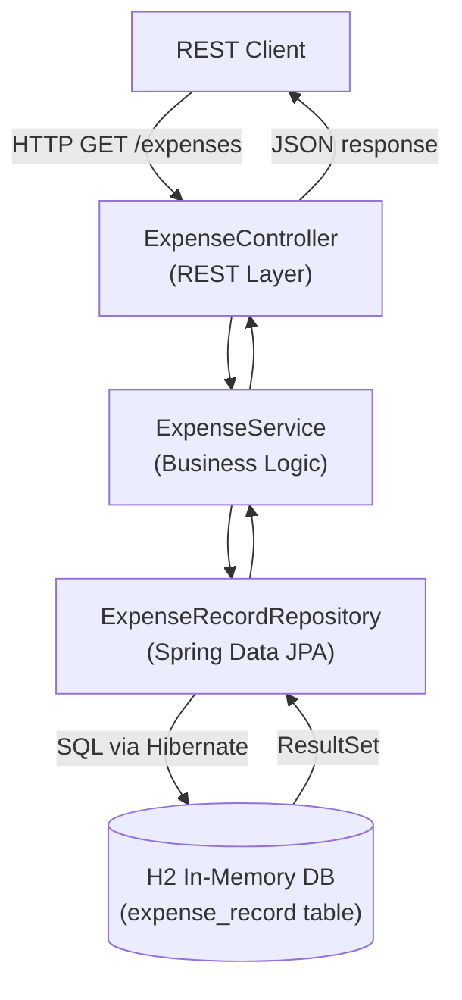

We recently started building out `expense-datalake-service` — a new microservice responsible for aggregating and serving expense data across our platform. Like most new services, we wanted to move fast in the early stages: write the domain model, wire up the REST layer, get tests running — without the overhead of standing up a real database on day one.

H2 was the obvious choice.

## What Is H2?

H2 is a relational database written entirely in Java. It can run embedded inside your application (no separate server process), stores data in-memory (wiped on restart, perfect for tests), and speaks standard SQL. The whole JAR is under 2 MB.

For local development and integration testing on a microservice, it ticks every box:

- Zero infrastructure to set up
- Fast startup
- Ships with a browser-based console you can use to inspect data
- Works out of the box with Spring Boot and JPA

The tradeoff is obvious: it is not what you run in production. We knew from the start that `expense-datalake-service` would eventually move to a proper persistent store — but H2 let us build and iterate without that decision blocking us.

## Adding the Dependency

In `pom.xml`:

```xml
<dependency>
    <groupId>com.h2database</groupId>
    <artifactId>h2</artifactId>
    <scope>runtime</scope>
</dependency>
```

Spring Boot auto-configures an embedded H2 instance when it finds the H2 JAR on the classpath and no other `DataSource` is configured. You don't need to write a `DataSource` bean — it just works.

If you're using Gradle:

```groovy
runtimeOnly 'com.h2database:h2'
```

## Application Configuration

In `src/main/resources/application.properties`:

```properties
# H2 in-memory database
spring.datasource.url=jdbc:h2:mem:expensedatalake;DB_CLOSE_DELAY=-1;DB_CLOSE_ON_EXIT=FALSE
spring.datasource.driver-class-name=org.h2.Driver
spring.datasource.username=sa
spring.datasource.password=

# JPA / Hibernate
spring.jpa.database-platform=org.hibernate.dialect.H2Dialect
spring.jpa.hibernate.ddl-auto=create-drop
spring.jpa.show-sql=true

# H2 Console (for local inspection)
spring.h2.console.enabled=true
spring.h2.console.path=/h2-console
```

A few things worth explaining:

**`DB_CLOSE_DELAY=-1`** — by default, H2 closes an in-memory database when the last connection is released. If you have a connection pool that briefly drops to zero connections, your schema disappears. `DB_CLOSE_DELAY=-1` keeps the database alive as long as the JVM is running.

**`ddl-auto=create-drop`** — Hibernate creates the schema on startup and drops it on shutdown. Good for development. For production you'd use `validate` or `none` and manage schema separately.

**`show-sql=true`** — logs every SQL statement. Noisy, but useful while you're building the domain model.

## The Domain Model

Here's a simplified version of the main entity we were working with:

```java
@Entity
@Table(name = "expense_record")
public class ExpenseRecord {

    @Id
    @GeneratedValue(strategy = GenerationType.IDENTITY)
    private Long id;

    @Column(name = "report_id", nullable = false)
    private String reportId;

    @Column(name = "employee_id", nullable = false)
    private String employeeId;

    @Column(name = "amount", nullable = false)
    private BigDecimal amount;

    @Column(name = "currency_code", length = 3)
    private String currencyCode;

    @Column(name = "expense_date", nullable = false)
    private LocalDate expenseDate;

    @Column(name = "created_at", nullable = false)
    private Instant createdAt;

    // constructors, getters, setters
}
```

Spring Boot with JPA will create the `expense_record` table automatically from this entity definition when the application starts.

## The Repository

```java
@Repository
public interface ExpenseRecordRepository extends JpaRepository<ExpenseRecord, Long> {

    List<ExpenseRecord> findByEmployeeId(String employeeId);

    List<ExpenseRecord> findByReportId(String reportId);

    @Query("SELECT e FROM ExpenseRecord e WHERE e.expenseDate BETWEEN :from AND :to")
    List<ExpenseRecord> findByDateRange(
        @Param("from") LocalDate from,
        @Param("to") LocalDate to
    );
}
```

## Seeding Test Data

For integration tests and local development, it's useful to have some data in the database on startup. Spring Boot will automatically run `src/main/resources/data.sql` after the schema is created:

```sql
INSERT INTO expense_record (report_id, employee_id, amount, currency_code, expense_date, created_at)
VALUES ('RPT-001', 'EMP-123', 45.50, 'USD', '2018-01-15', CURRENT_TIMESTAMP);

INSERT INTO expense_record (report_id, employee_id, amount, currency_code, expense_date, created_at)
VALUES ('RPT-001', 'EMP-123', 120.00, 'USD', '2018-01-16', CURRENT_TIMESTAMP);

INSERT INTO expense_record (report_id, employee_id, amount, currency_code, expense_date, created_at)
VALUES ('RPT-002', 'EMP-456', 88.75, 'EUR', '2018-01-20', CURRENT_TIMESTAMP);
```

If you need more control — particularly in tests — you can use `@Sql` annotations:

```java
@SpringBootTest
@Sql(scripts = "/test-data/expense-records.sql", executionPhase = Sql.ExecutionPhase.BEFORE_TEST_METHOD)
@Sql(scripts = "/test-data/cleanup.sql", executionPhase = Sql.ExecutionPhase.AFTER_TEST_METHOD)
class ExpenseRecordRepositoryTest {

    @Autowired
    private ExpenseRecordRepository repository;

    @Test
    void findByEmployeeId_returnsMatchingRecords() {
        List<ExpenseRecord> records = repository.findByEmployeeId("EMP-123");
        assertThat(records).hasSize(2);
    }
}
```

## The H2 Console

One of the most useful features for development: H2 ships with a browser-based SQL console. With `spring.h2.console.enabled=true`, navigate to `http://localhost:8080/h2-console` while your application is running.

Connect with:
- **JDBC URL**: `jdbc:h2:mem:expensedatalake`
- **User Name**: `sa`
- **Password**: (blank)

You get a full SQL editor, table browser, and query results — handy for checking what Hibernate actually created and whether your seed data loaded correctly.

> **Note**: Disable the console in non-local profiles. You don't want it exposed in any environment beyond your laptop.

```properties
# In application-dev.properties — enable
spring.h2.console.enabled=true

# In application-prod.properties — disable
spring.h2.console.enabled=false
```

## Application Architecture

Here's how the layers connect in a typical request flow through `expense-datalake-service`:



## Profile-Based Switching

The clean approach is to keep H2 in a `dev` or `test` profile, and point `prod` at the real database. In `expense-datalake-service` we set this up early, even before we had a production database decided:

`application.properties` (shared defaults):
```properties
spring.application.name=expense-datalake-service
server.port=8080
```

`application-dev.properties`:
```properties
spring.datasource.url=jdbc:h2:mem:expensedatalake;DB_CLOSE_DELAY=-1
spring.datasource.driver-class-name=org.h2.Driver
spring.datasource.username=sa
spring.datasource.password=
spring.jpa.hibernate.ddl-auto=create-drop
spring.h2.console.enabled=true
```

`application-prod.properties` (placeholder at this point):
```properties
# Will be replaced with actual DB config
spring.datasource.url=${DB_URL}
spring.datasource.username=${DB_USERNAME}
spring.datasource.password=${DB_PASSWORD}
spring.jpa.hibernate.ddl-auto=validate
spring.h2.console.enabled=false
```

Run with `--spring.profiles.active=dev` locally and `--spring.profiles.active=prod` in deployment.

## What We Learned

A few things that tripped us up:

**Schema drift** — because `create-drop` rebuilds the schema on every restart, it's easy to let your entity classes drift out of sync with what a real database would require. We started maintaining a `schema.sql` alongside the entity classes early, even though H2 didn't need it, so we'd have something to hand off when migration time came.

**H2 SQL dialect** — H2 is mostly compatible with standard SQL but has quirks. A few queries that worked fine in H2 needed adjustment when we moved to the real database. If you're writing raw queries or native SQL, test them against the target database type too.

**In-memory means gone** — obvious in theory, but you will forget at least once and wonder why all your test data disappeared after restarting the application. That's expected behaviour. If you need data to persist across restarts during development, use the file-based mode: `jdbc:h2:file:./data/expensedatalake`.

---

H2 served `expense-datalake-service` well through the early development phase. Once we had the schema stabilised and understood our access patterns, we migrated to a purpose-built store better suited for the data volume and query shapes we needed. But that is a post for another day.
