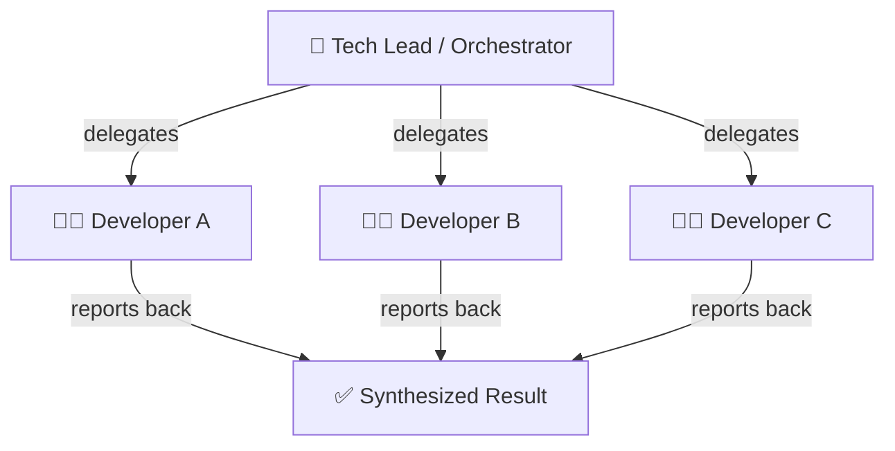
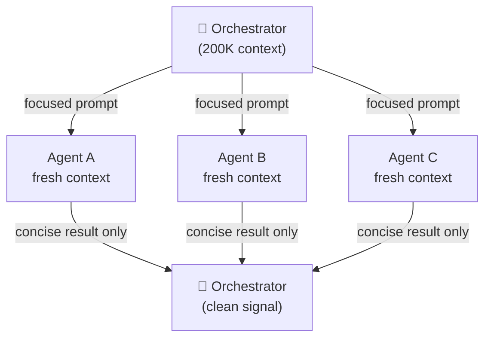
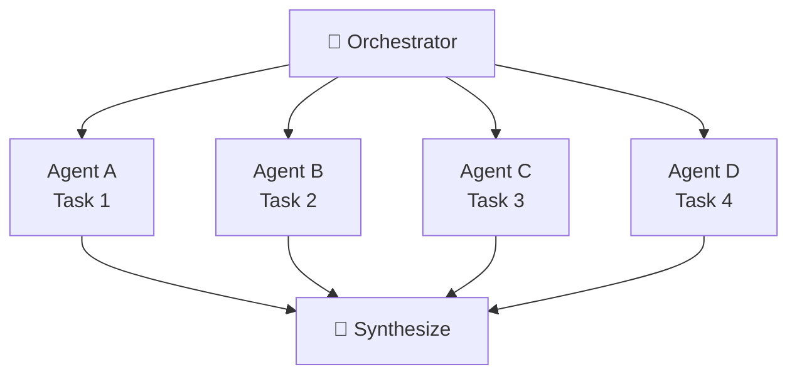
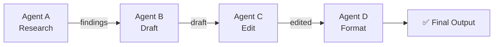
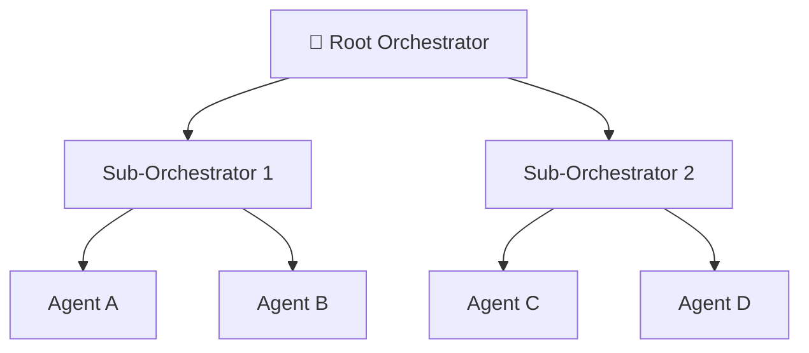
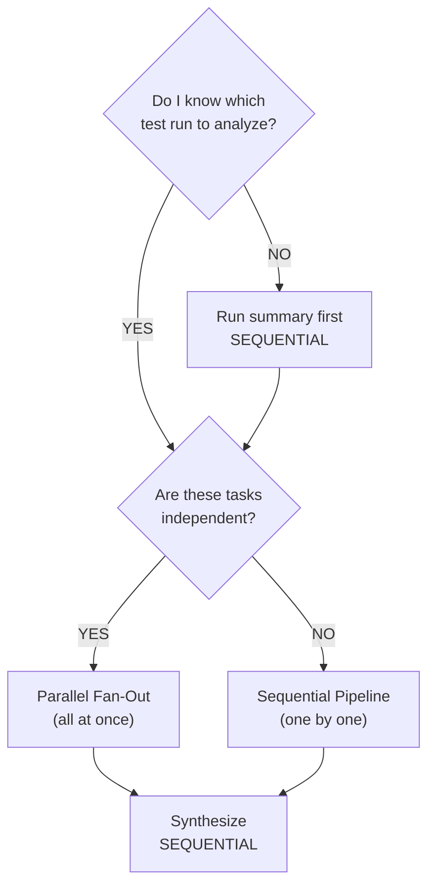
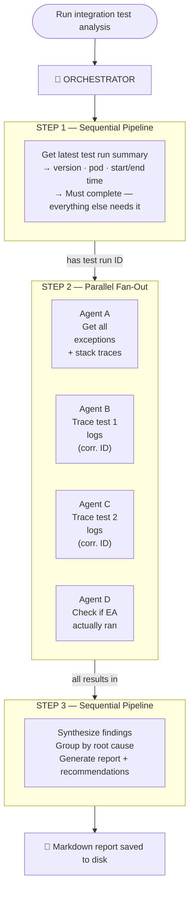
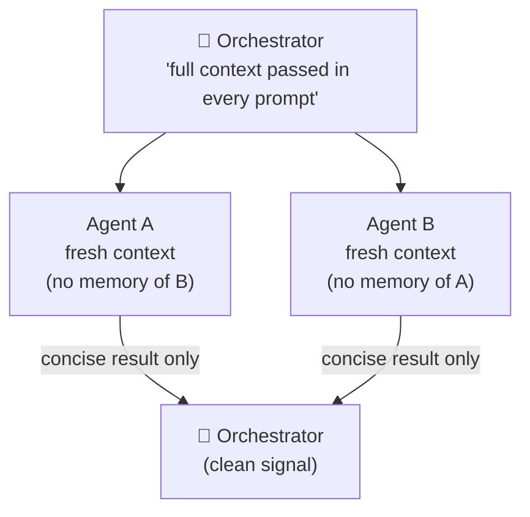
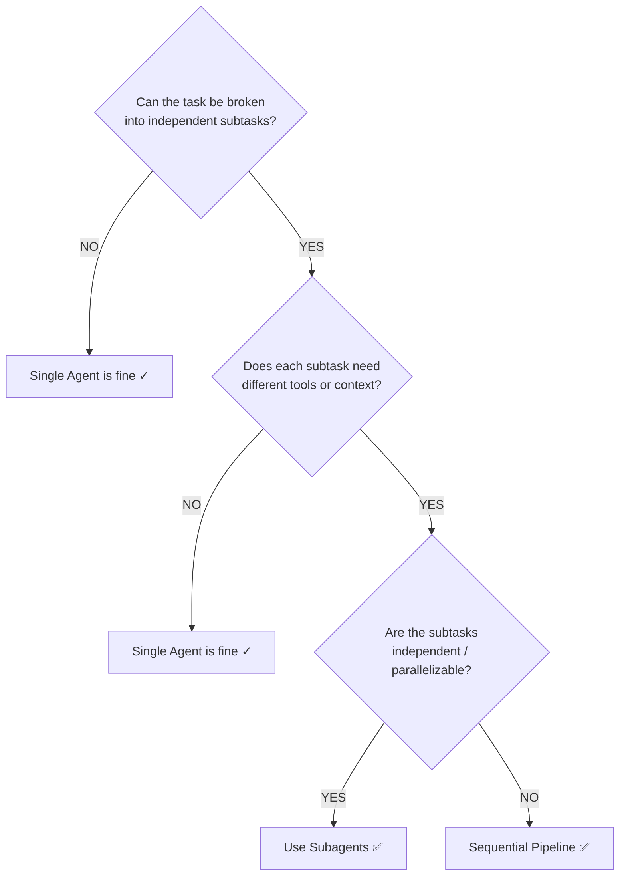

Most AI demos show a single model answering a single question. That's not how you solve real engineering problems.

A single AI agent working sequentially is like a senior developer who reads one log file, then another, then another — never delegating, blocking on every step, getting slower as the problem gets more complex. There's a better way.

## What Is a Subagent?

A subagent is an AI instance invoked by an orchestrating AI to handle a specific subtask within a larger workflow. Think of it like a tech lead and a team: the tech lead doesn't do everything — they decompose the problem, assign the right people, and synthesize the results. Claude does the same thing.



The orchestrator reasons about what needs to happen, who should do it, and what constitutes a useful answer. It doesn't execute everything itself.

## Two Superpowers

### Parallelization

Sequential execution is the default. Parallel execution is the unlock:

```mermaid
gantt
    title Sequential vs Parallel Execution
    dateFormat X
    axisFormat %s min

    section Sequential (30 min)
    Task A :0, 10
    Task B :10, 20
    Task C :20, 30

    section Parallel (10 min)
    Task A :0, 10
    Task B :0, 10
    Task C :0, 10
```



Three independent tasks that each take ten minutes take thirty minutes sequentially and ten minutes in parallel. That's the whole case.

### Context Isolation

Each subagent gets its own fresh context window. The orchestrator passes only what's relevant to each agent, and each agent returns only the relevant result — not its entire reasoning trace.



This matters more than it looks. A single agent investigating multiple things accumulates noise — log lines from task A pollute the reasoning about task B. Isolated agents stay focused. The orchestrator only absorbs what it needs.

## The Number That Matters

Anthropic's internal research system — using subagent orchestration — outperformed a single Claude Opus 4 by **90.2%** on benchmarks. Not a different model. Not more data. Just orchestration.

## Three Orchestration Patterns

Every multi-agent system is built from three patterns. Understanding them lets you design — or recognize — any agentic workflow.

### Pattern 1: Parallel Fan-Out

*"I have N independent tasks — run them all at once."*



Best for: analyzing multiple documents, investigating multiple systems, tracing multiple test failures simultaneously.

### Pattern 2: Sequential Pipeline

*"Each step depends on the previous — chain them."*



Best for: research → analysis → recommendation chains. Any workflow with hard dependencies between steps.

### Pattern 3: Hierarchical Delegation

*"A subagent becomes an orchestrator for its own subtasks."*



Best for: genuinely complex problems that decompose recursively — where the orchestrator must reason about which sub-problems need their own orchestration layer.

## Skills vs Subagents

These two concepts get conflated but they're completely different:

| | Skills | Subagents |
|---|---|---|
| What they are | Passive knowledge documents | Active execution units |
| What they do | Tell Claude **how to think** | Actually **do the work** |
| Analogy | A runbook on a wiki | A dev executing the runbook |

Skills tell. Subagents act.

## A Real Example: Integration Test Analysis

Here's a concrete problem: 253 integration tests ran. 89 failed. How do you find the root causes quickly?

Without subagents, a developer investigates sequentially:

1. Open Kibana — 5 min
2. Search for failing tests — 5 min
3. Pick one test, trace logs — 5 min
4. Repeat for the next test — 5 min
5. Check Expense Assistant logs — 5 min
6. Write up findings — 10 min

Total: ~35 minutes, and that's for partial coverage of the failure set.

With subagents, an orchestrator runs all of this in parallel after one sequential setup step. The whole thing takes about two minutes.

### How the Orchestrator Decides What to Run

The orchestrator reasons about the dependency graph before dispatching anything:



You didn't write that decision tree. Claude reasoned it.

### The Full Flow — All Three Patterns in One Tool

An integration test analysis tool like this uses all three patterns in a single workflow:



Step 1 is sequential — you can't trace a test run you haven't identified yet. Step 2 is a full parallel fan-out — all four agents run simultaneously because none of them depend on each other. Step 3 is sequential again — synthesis requires all the data from Step 2 to be present.

### What the Report Looks Like

After two minutes, you get a structured report:

```
Application:  smart-expense-service (version: federal_lie)
Git Hash:     629d33a46
Pod:          ses-integration-test-29561580-7njn2
Total: 253 | Passed: 106 | Failed: 89 | Skipped: 26

ROOT CAUSE CATEGORIES
──────────────────────────────────────────────────────────
Category A — Envelope Lock State                 34 tests
  → envelope.assignmentLocked=true blocking merge
  → One upstream test leaking lock state

Category B — EA Did Not Run                      28 tests
  → Expense Assistant never triggered
  → Confirmed by Agent D: no EA pod activity

Category C — Null Reference (same root)          27 tests
  → EnvelopeService.getById() returning null
  → 3 different call sites, one fix needed

RECOMMENDATIONS
──────────────────────────────────────────────────────────
1. [CRITICAL]  Fix null handling in getById()         → 27 tests
2. [HIGH]      Fix test isolation — lock state leak   → 34 tests
3. [HIGH]      Investigate EA trigger condition       → 28 tests
```

89 failures → 3 root causes → 3 action items. In two minutes instead of thirty-five.

## The Critical Constraint: Context Is Not Shared

This is the part that trips people up when designing multi-agent systems:



Each subagent starts completely fresh. It has no memory of what other agents found. This means:

- The orchestrator must pass all needed context in each agent's prompt
- Agents must return only the relevant result — not their full reasoning trace
- Poorly designed agents dump their entire context back → orchestrator context overflows

A well-designed trace agent returns: correlation ID, timeline of key events, exception message, probable root cause. Four things. Not the entire Elasticsearch response.

## When to Actually Use Subagents

Not everything needs orchestration. Here's the decision tree:



Start with a single agent. Introduce orchestration only when the complexity genuinely demands it.

## How to Build Your Own

In Claude Code, subagents are markdown files in `.claude/agents/`. Here's a focused log-tracing agent:

```markdown
---
name: test-tracer
description: Traces a specific integration test by correlation ID.
             PROACTIVELY use when given a test name and timestamp.
tools: mcp__kibana-integration__quick_search,
       mcp__kibana-integration__trace_request
model: claude-haiku-4-5
---

Given a test name and timestamp, find its correlation ID and return:
- Timeline of key events (max 10 lines)
- The exception message
- Probable root cause (one sentence)

Return ONLY these three things. Be concise.
```

Four design decisions matter here:

- **`description`** — tells the orchestrator *when* to use this agent, not just what it does
- **`tools`** — restricted to only what this agent needs (least privilege)
- **`model`** — Haiku for focused tasks, save Opus for the orchestrator
- **prompt body** — explicitly demands concise output to protect the orchestrator's context window

## The Takeaway

| | Time | Coverage |
|---|---|---|
| Junior dev | 35 min | 1 root cause |
| Senior dev | 35 min | 3 root causes |
| Claude with subagents | 2 min | 3 root causes + written report |

The insight isn't just speed. It's that the orchestrator understands the *shape* of the problem — what's independent, what's dependent, what needs its own focused investigation — and routes accordingly.

That's not a language model completing a prompt. That's an agent.

---

*This post draws from [Subagents — The Building Block of Agentic AI](https://akdevcraft.substack.com/p/subagents-the-building-block-of-agentic)*
